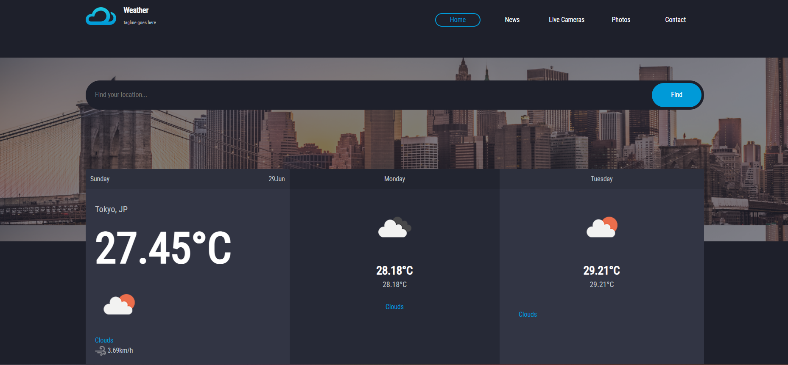

  

    
    
    
    
  

  <h3>📚 WEATHER</h3>

Get accurate and stylish 3-day weather forecasts based on your location or any city you search for. This responsive web application uses the **OpenWeatherMap API** to deliver real-time weather data, including temperature, conditions, and wind speed—presented in a clean, modern UI built with **HTML**, **CSS (Bootstrap)**, and **vanilla JavaScript**.

---

## ✨ Features

- 📍 **Auto-detects your city** using IP geolocation  
- 🔍 **Search** for weather in any city worldwide  
- 🌡️ **Displays today's weather** with temperature, conditions, and wind  
- 📅 **Includes a 2-day forecast** with max/min temperatures and icons  
- 🚨 **Graceful error handling** with user-friendly alert messages  
- ⚡ **Fully responsive** and optimized for all screen sizes  

## 🚀 Live Demo

Try the weather app now: [weather-netlify](https://683f8e985737f430a864184b--melodious-sunflower-827495.netlify.app/)

---
## 🛠️ Built With

- HTML5  
- CSS3 (Bootstrap)  
- JavaScript (ES6)  
- [OpenWeatherMap API](https://openweathermap.org/api)  
- [IPAPI for location detection](https://ipapi.co/)

